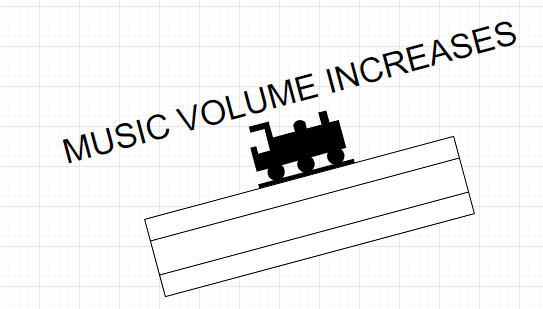
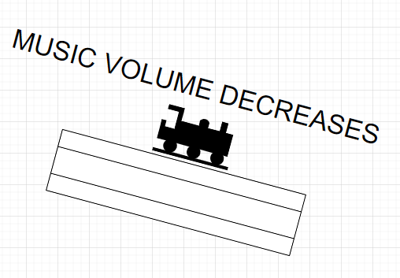
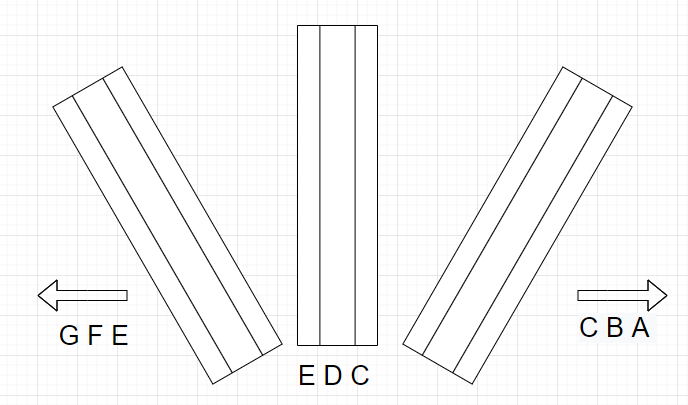
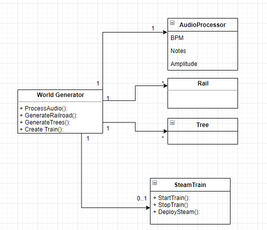

# GamesEngine1Assignment
This project is for the Games engine 1 assignment where I will create and audio visualizer using a train traversing nature.

# Introduction
This proposal will detail my idea for the games engine 1 assignment. My proposal is to create a procedurally generated railroad in which the setting and railroad alter and transform with synchronized music. The railroad generation and the world that is generated for the train to travel through will be dependent on the different characteristics found in music. Some of these characteristics include; rhythm, the element of time within music and the speed of the beat, dynamics of music such as the loudness or quietness of music (Crescendo and descrescendo), melody,  which is the presentation of pitch or in other words the highness or the lowness of a note or sound and finally harmony the combination of pitches to create chords. 

Each of these aspects will be implemented within this railroad music visualization and I will go through each proposed idea. Firstly I will go over the proposed models for this application.

# Models:
Models:
Steam train:

The steam train will be traversing the environment created by the music in this procedurally generated world.  

Railroad track:

This will be how the steam train will traverse through the generated world. This railroad will change with the characteristics of the music playing.

Tree:

These will populate the terrain along and be influenced by the music also.

# Musical Characteristics
## Rhythm 
Rhythm is the pattern in music with regard to time, rhythm is normally compared with the beat of the music. I hope to use rhythm to control the speed of the train, the beats per minute (BPM) of music would be a unique attribute to use for speed and I think it would work the best for the control of the speed of the train. Another use for the BPM of the music would be to control the movement of the trees. I feel to have the trees bounce or make some irregular movement would be a nice visual representation of the beat in the music. 

## Dynamics 
Dynamics refers to the variation of loudness in music, so how soft or how loud music can be in certain parts of a song. I will use this to change the elevation of the railroad, as the music starts to get louder the railroad will start to elevate slightly and as the music gets quieter the railroad will slope down slightly giving this 3d effect to an audio visualizer. 

## Melody 
Melody is the combination of pitch and rhythm, the pitch is the highness and the lowness of a note. I hope to use melody to guide the direction of the train. Higher notes on the music scale will make the railroad slightly turn left while lower notes on the scale will make the railroad slightly turn right.

# Design 
This is a simple class diagram, I envision 5 main classes in the development of this program. The first class is the world generator, this will handle the creation of the railroad and world for the train to traverse. The audio generator will process the music selected to give calculations to how the world should be created with reference to the music selected. These calculations will then be used to layout the terrain and railroad for the train. There will also be a method to initialize the steam train.

# Research and Inspirations
My main inspiration for this project is this video which captures a train going through the snowy mountains of Norway.

Another inspiration is an audio visualizer I found that traversed through anatural setting full of beautiful colours.

I had a little research into how music would operate and how I could use it with world generation, this document helped me find out the different characteristics of music 

https://wmich.edu/mus-gened/mus150/Ch1-elements.pdf

